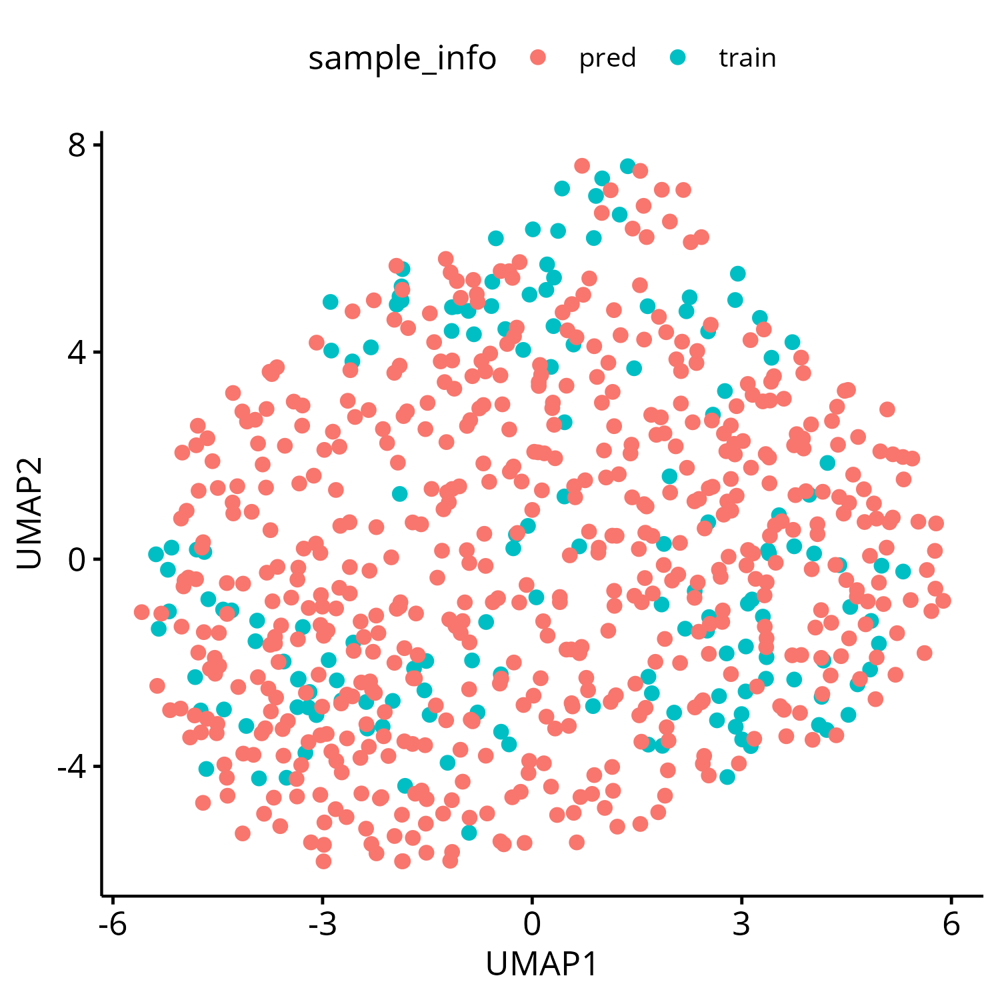
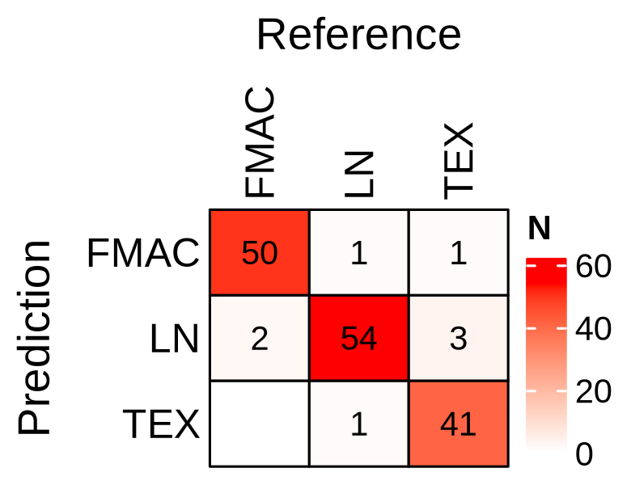
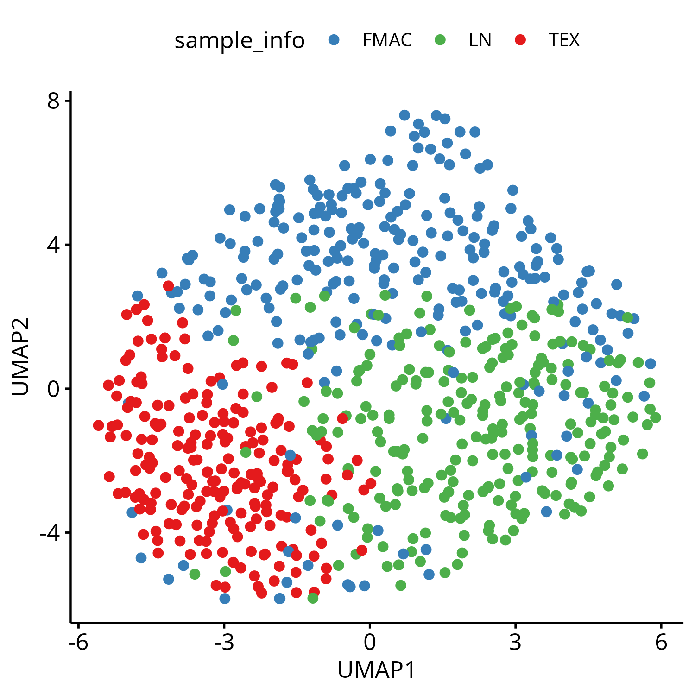

```{r, include = FALSE}
knitr::opts_chunk$set(
  collapse = TRUE,
  comment = "#>"
)
```

```{r setup}
library(LymphoMapR)
```

In this tutorial, we demonstrate the use of LymphoMapR on a gene expression dataset of diffuse large B-cell lymphoma (DLBCL) published by Schmitz et al. in the New England Journal of Medicine (Volume 378, pages 1396–1407, April 12, 2018). The RNAseq data with normalized FPKM values in log2 scale (file name: RNAseq_gene_expression_562.txt) can be downloaded from https://gdc.cancer.gov/about-data/publications/DLBCL-2018

## Data preprocessing

```{r, echo = TRUE, eval = FALSE}
df <- read.table("RNAseq_gene_expression_562.txt", header = TRUE, sep = "\t")
df <- df[, -c(2:3)] # keep gene symbols (1st column) and remove columns 2-3 of gene meta data
expr_matrix <- as.matrix(df[, -1])
rownames(expr_matrix) <- df[[1]]
```

The main function in LymphoMapR is `run_LymphoMAP()`, which accepts a gene expression matrix as input. Supported data types include log2-transformed TPM or count data from RNA-seq, log2-normalized microarray data, and normalized counts from NanoString nCounter. Since this dataset contains log2-transformed FPKM values, we first convert them to log2-scale TPM values prior to classification.

```{r, echo = TRUE, eval = FALSE}
tpm <- fpkm_to_tpm(2^expr_matrix - 1)
expr_matrix <- log2(tpm + 1)
```

## LymphoMAP classification

In LymphoMapR, the `run_LymphoMAP()` function integrates the input expression data with an internal training dataset and applies a Naive Bayes model to classify each sample into one of the LymphoMAP archetypes. Samples with classification probabilities below the `LymphoMAP_prob_cutoff` threshold are labeled as unassigned. Benchmarking of model performance suggests that using 50–200 features per archetype yields optimal overall accuracy.

```{r, echo = TRUE, eval = FALSE}
# LymphoMap model training and prediction (running this function takes ~3 minutes)
res <- run_LymphoMap(expr_matrix, 
                     data_type = "RNAseq_TPM_log2p1")
#> Data prep
#> Aligning expression distribution to training data for all genes
#> Calculating DEGs between archetypes
#> Feature selection
#> Aligning expression distribution to training data for selected features
#> Scale expressions based on training data
#> Naive Bayes model training
#> Performance evaluation via cross validation
#> Final prediction
#> Done
```

```{r, echo = TRUE, eval = FALSE}
res
#> LymphoMAP Model and Prediction
#> Accuracy from cross-validation: 0.9477 
#> Final label assignments:
#> 
#> FMAC   LN  TEX
#>  207  194  161
```

## Visualization of the generated results

First, we combine the training and prediction data.

```{r, echo = TRUE, eval = FALSE}
mt <- rbind(res$data$X_train, res$data$X_pred)
y <- c(res$data$y_train, res$y_pred)

sample_datasets <- c(rep("train", nrow(res$data$X_train)),
                     rep("pred", nrow(res$data$X_pred)))
names(sample_datasets) <- c(rownames(res$data$X_train),
                            rownames(res$data$X_pred))
```

Plot UMAP of expression distribution to see if the integrated data has batch effect.

```{r, echo = TRUE, eval = FALSE}
plot_umap(mt, sample_datasets)
```

```{r, echo = FALSE, out.width = "50%"}

```

On UMAP, the integrated data doesn't have major batch effect between the training and prediction datasets.

Now, let's check the model performance via confusion matrix.

```{r, echo = TRUE, eval = FALSE}
print(res$cv_confmat)
#> Confusion Matrix and Statistics
#> 
#>           Reference
#> Prediction FMAC LN TEX
#>       FMAC   50  1   1
#>       LN      2 54   3
#>       TEX     0  1  41
#> 
#> Overall Statistics
#>                                           
#>                Accuracy : 0.9477          
#>                  95% CI : (0.8996, 0.9772)
#>     No Information Rate : 0.366           
#>     P-Value [Acc > NIR] : <2e-16          
#>                                           
#>                   Kappa : 0.9211          
#>                                           
#>  Mcnemar's Test P-Value : 0.5062          
#> 
#> Statistics by Class:
#> 
#>                      Class: FMAC Class: LN Class: TEX
#> Sensitivity               0.9615    0.9643     0.9111
#> Specificity               0.9802    0.9485     0.9907
#> Pos Pred Value            0.9615    0.9153     0.9762
#> Neg Pred Value            0.9802    0.9787     0.9640
#> Prevalence                0.3399    0.3660     0.2941
#> Detection Rate            0.3268    0.3529     0.2680
#> Detection Prevalence      0.3399    0.3856     0.2745
#> Balanced Accuracy         0.9709    0.9564     0.9509
```

```{r, echo = TRUE, eval = FALSE}
# Plot cross-validation confusion matrix of the trained model. Reference: true labels.
plot_confmat(res$cv_confmat)
```

```{r, echo = FALSE, out.width = "50%"}

```

Plot UMAP by LymphoMAP labels.

```{r, echo = TRUE, eval = FALSE}
plot_umap_archetype(mt, y)
```

```{r, echo = FALSE, out.width = "50%"}

```

